# PermiForce: Azure DevOps PR Approval System with Permit.io

> **Note**: This project is a submission to the [Permit.io Authorization Challenge](https://dev.to/challenges/permit_io) on dev.to. It demonstrates the implementation of fine-grained authorization using Permit.io in a real-world DevOps scenario.

## Table of Contents

- [Overview](#overview)
- [Motive](#motive)
- [Core Concepts](#core-concepts)
- [User Roles and Permissions](#user-roles-and-permissions)
- [Setup Instructions](#setup-instructions)
  - [Prerequisites](#prerequisites)
  - [Azure DevOps Setup](#azure-devops-setup)
  - [Permit.io Setup](#permitio-setup)
- [Permission Structure](#permission-structure)
  - [Permission Hierarchy](#permission-hierarchy)
  - [Security Controls](#security-controls)
  - [Permission Flow](#permission-flow)
  - [Critical Permissions](#critical-permissions)
  - [Permission Validation Process](#permission-validation-process)
  - [Permission Matrix](#permission-matrix)
- [Testing the System](#testing-the-system)
- [Troubleshooting](#troubleshooting)
- [Technical Details](#technical-details)
  - [System Architecture](#system-architecture)
  - [Pipeline Components](#pipeline-components)
  - [Pipeline Flow](#pipeline-flow)
  - [Environment Configuration](#environment-configuration)
  - [Server Endpoints](#server-endpoints)
  - [Error Handling](#error-handling)
  - [Monitoring and Logging](#monitoring-and-logging)
  - [Best Practices](#best-practices)
  - [Troubleshooting Guide](#troubleshooting-guide)
- [Use Cases](#use-cases)
  - [Core Use Cases](#core-use-cases)
  - [Advanced Integration Scenarios](#advanced-integration-scenarios)
  - [Implementation Examples](#implementation-examples)
  - [Benefits Matrix](#benefits-matrix)
  - [Real-world Scenarios](#real-world-scenarios)
- [Thank You](#thank-you)

## Overview

PermiForce is a sophisticated Pull Request approval system that integrates Azure DevOps with Permit.io's fine-grained permission control. It ensures that only authorized personnel can approve and merge code changes into protected branches, maintaining code quality and security.

## Motive

**PermiForce** solves key challenges in modern software development by providing enhanced security, compliance, and developer-friendly processes.

| **Aspect** | **Benefits** | **Key Features** |
|------------|-------------|------------------|
| **🔒 Enhanced Security** | - Prevents unauthorized changes<br>- Ensures proper access control | - Fine-grained PR-level access control<br>- Principle of Least Privilege<br>- Protected branch management |
| **📑 Compliance & Audit** | - Ensures regulatory compliance<br>- Provides accountability | - Comprehensive audit trails<br>- Clear role separation<br>- Transparent approval tracking |
| **👨‍💻 Developer Experience** | - Faster development cycles<br>- Reduced friction in PR process | - Streamlined PR approvals<br>- Self-service access management<br>- Real-time permission feedback |
| **💼 Business Benefits** | - Reduced deployment risks<br>- Improved release management | - Controlled deployments<br>- Faster approval cycles<br>- Better release visibility |
| **⚙️ Technical Advantages** | - Simplified permission management<br>- Scalable solution | - Centralized permission control<br>- Real-time validation<br>- Easy Azure DevOps integration |

---

### 📝 **Comparison: Azure DevOps vs. Permit.io**

| **Feature**                         | **Azure DevOps** | **Permit.io**                |
|-------------------------------------|------------------|------------------------------|
| **Granular Access Control**         | ❌ Limited       | ✅ Fine-grained PR-level control |
| **Role-Based Access**               | ✅ Basic         | ✅ Advanced (Custom Roles)    |
| **Audit Trails for Approvals**      | ❌ Limited       | ✅ Full audit trail & visibility |
| **Real-Time Permission Validation** | ❌ Delayed       | ✅ Instant validation via API |
| **Compliance Reporting**            | ❌ Complex       | ✅ Simple & automated reports |

---

### **Why Permit.io?**

- **Azure DevOps** lacks precise, dynamic PR-level access control.
- **Permit.io** fills the gap by providing granular role-based permissions, streamlined compliance tracking, and enhanced security for DevOps workflows.

## Core Concepts

The system is built around three main components:

1. **Role-Based Access Control (RBAC)**: Defines who can perform specific actions
2. **Branch Protection**: Ensures protected branches (qa, uat, prod) have proper approvals
3. **Automated Validation**: Checks permissions and approvals automatically in the CI/CD pipeline

## User Roles and Permissions

| **Role** | **Permissions** | **Users** | **Branch Access** |
|----------|----------------|-----------|------------------|
| **👨‍💻 Developer** | - `CREATE_QA_PR`<br>- Cannot approve any PRs | - alice@permiforce.com<br>- bob@permiforce.com | ✅ Can create PRs to QA<br>❌ Cannot create PRs to UAT<br>❌ Cannot create PRs to PROD |
| **👨‍💼 Team Lead** | - `CREATE_UAT_PR`<br>- `APPROVE_QA_PR`<br>- `APPROVE_UAT_PR` | - carol@permiforce.com | ✅ Can create PRs to UAT<br>✅ Can approve QA/UAT PRs<br>❌ Cannot create/approve PROD PRs |
| **👨‍💼 Release Manager** | - `APPROVE_PROD_PR`<br>- `APPROVE_QA_PR`<br>- `APPROVE_UAT_PR`<br>- `CREATE_PROD_PR`<br>- `CREATE_QA_PR`<br>- `CREATE_UAT_PR` | - shivamsfdc.work@gmail.com | ✅ Full access to all branches<br>✅ Can create PRs to any branch<br>✅ Can approve any PR |

### Detailed Permission Matrix


### Permission Flow Examples
1.  **QA Branch Flow**

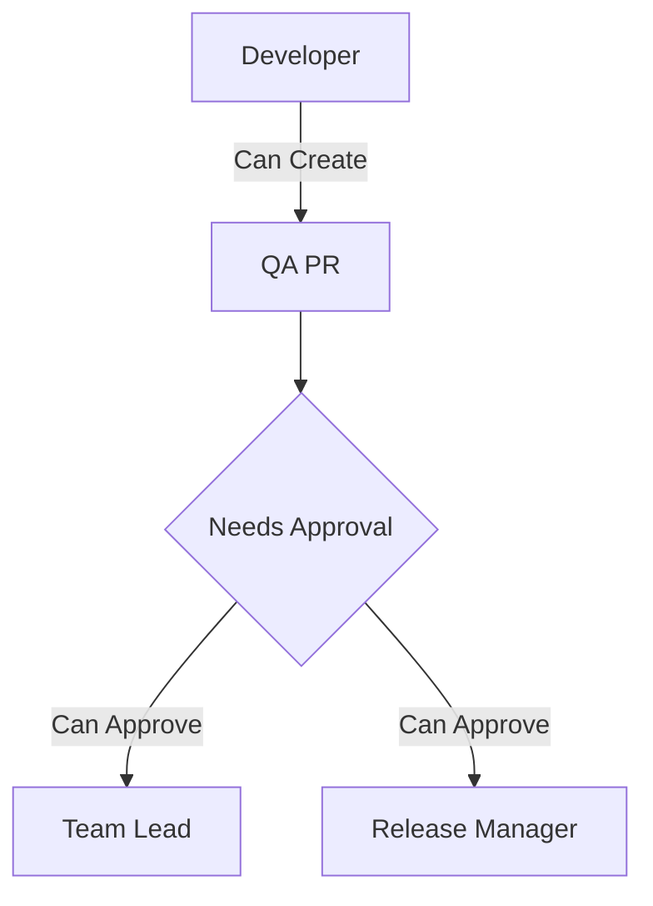

2.  **UAT Branch Flow**

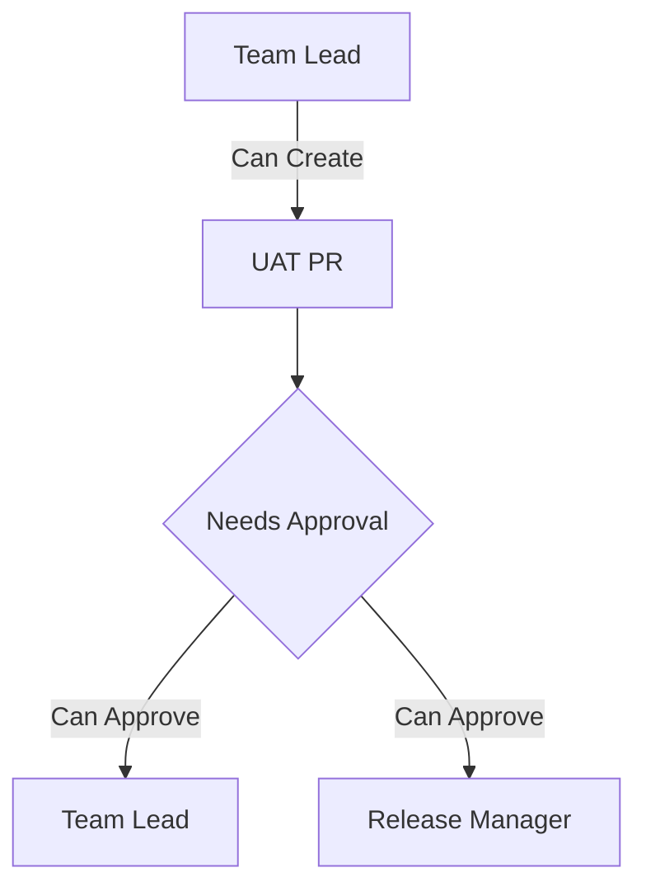

3.  **Production Branch Flow**

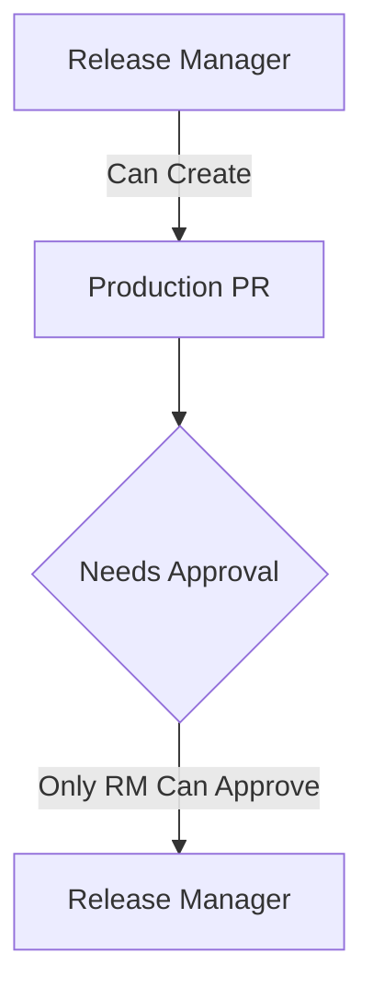

### Branch Protection Rules


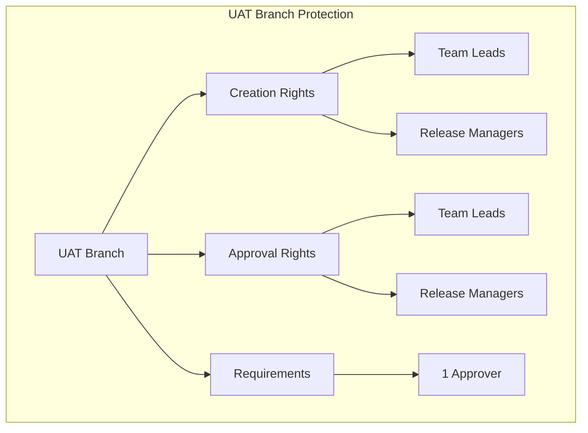
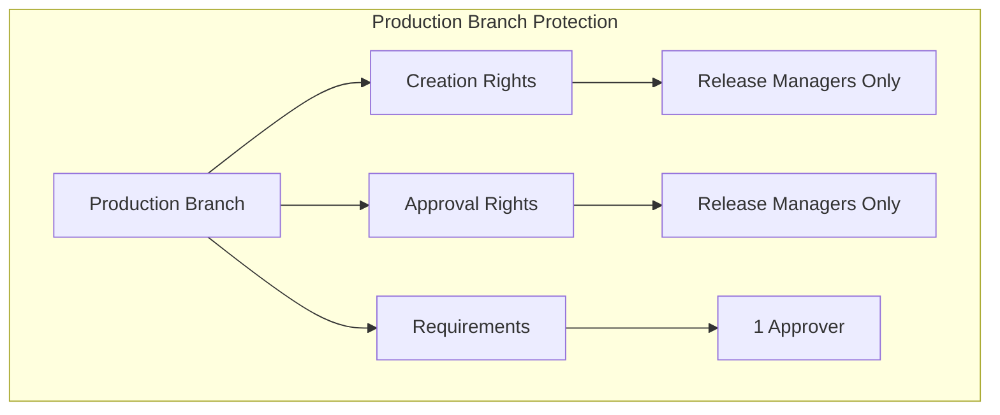

## Setup Instructions

### Prerequisites

- [Azure DevOps account](https://azure.microsoft.com/en-us/services/devops/) with admin access
- [Permit.io account](https://www.permit.io/)
- [Node.js 18.x](https://nodejs.org/en/download/) or higher
- [Git](https://git-scm.com/downloads)

### Azure DevOps Setup

1. **Create a New Pipeline**
   - Navigate to the Azure DevOps project where you want to create the pipeline
   - Click on **Pipelines** in the left sidebar, then click on **New Pipeline**
   - Select the repository you wish to use for your pipeline
   - Choose **YAML** as the pipeline configuration option
   - Select **Start from scratch** or choose an existing YAML template if available
   - In the pipeline editor, use the default YAML configuration and ensure that `main-pipeline.yml` is set as the YAML file to be used for all branches

   For detailed instructions, refer to the [Azure DevOps Pipeline documentation](https://docs.microsoft.com/en-us/azure/devops/pipelines/create-first-pipeline).

2. **Configure Variable Group**
   - Create a variable group named `permit-variables`
   - Add the following variables:
   ```
   PERMIT_API_KEY: [Your Permit.io API Key]
   PERMIT_PDP_URL: [Your Permit.io PDP URL]
   USER_NAME: [User's Email For Simulation]
   ```

   Learn more about [Azure DevOps Variable Groups](https://docs.microsoft.com/en-us/azure/devops/pipelines/library/variable-groups).

### Permit.io Setup

1. **Create a New Project**
   - Log in to [Permit.io](https://www.permit.io/)
   - Create a new project named "PermiForce" or any you like

2. **Define Resources**
   - Create a resource named "**DevOps**"
   - Add the following permissions/roles

   For detailed instructions, refer to the [Permit.io Documentation](https://docs.permit.io/).

3. **Install Permit.io SDK**
   ```bash
   npm install permitio
   ```

   For SDK documentation, visit [Permit.io SDK Documentation](https://docs.permit.io/sdk/).

## Permission Structure

The permission system in PermiForce is designed with a hierarchical structure that ensures secure and controlled access to different environments. Here's a detailed breakdown:

### Permission Hierarchy

| **Level** | **Permission** | **Description** | **Required For** |
|-----------|----------------|-----------------|------------------|
| **Level 1** | `CREATE_QA_PR` | Create PRs to QA branch | Developers, Team Leads, Release Managers |
| **Level 2** | `APPROVE_QA_PR` | Approve PRs to QA branch | Team Leads, Release Managers |
| **Level 3** | `CREATE_UAT_PR` | Create PRs to UAT branch | Team Leads, Release Managers |
| **Level 4** | `APPROVE_UAT_PR` | Approve PRs to UAT branch | Team Leads, Release Managers |
| **Level 5** | `CREATE_PROD_PR` | Create PRs to Production branch | Release Managers Only |
| **Level 6** | `APPROVE_PROD_PR` | Approve PRs to Production branch | Release Managers Only |

### Security Controls

| **Control** | **Implementation** | **Purpose** |
|-------------|-------------------|-------------|
| **Least Privilege** | Role-based access with minimal required permissions | Minimize security risks |
| **Separation of Duties** | Different roles for creation and approval | Prevent unauthorized changes |
| **Audit Trail** | Log all permission checks and approvals | Track and monitor access |
| **Real-time Validation** | Instant permission checks via Permit.io | Prevent unauthorized actions |

### Permission Flow

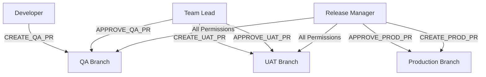

### Critical Permissions

The `APPROVE_PROD_PR` permission is the highest level of approval in the system:

- **Exclusive Access**: Only granted to Release Managers
- **No Delegation**: Cannot be delegated to lower-level roles
- **Additional Checks**: Requires extra validation in the pipeline
- **Audit Requirements**: All approvals are logged with detailed metadata

### Permission Validation Process

1. **Initial Check**
   - User attempts to create/approve PR
   - System validates user's role and permissions
   - Permit.io API is called for real-time validation

2. **Branch Protection**
   - System checks target branch protection rules
   - Validates required number of approvals
   - Ensures approvers have correct permissions

3. **Final Approval**
   - All checks must pass
   - Audit trail is updated
   - PR can be merged if all conditions are met

### Permission Matrix

| **Action** | **Developer** | **Team Lead** | **Release Manager** |
|------------|---------------|---------------|---------------------|
| **Create QA PR** | ✅ | ✅ | ✅ |
| **Approve QA PR** | ❌ | ✅ | ✅ |
| **Create UAT PR** | ❌ | ✅ | ✅ |
| **Approve UAT PR** | ❌ | ✅ | ✅ |
| **Create PROD PR** | ❌ | ❌ | ✅ |
| **Approve PROD PR** | ❌ | ❌ | ✅ |

## Testing the System

1. **Test as Developer**
   ```bash
   # Set pipeline variable
   user_name: alice@permiforce.com
   # Expected Results:
   - Can create PR to QA ✅
   - Cannot create PR to UAT ❌
   - Cannot create PR to PROD ❌
   ```


2. **Test as Team Lead**
   ```bash
   # Set pipeline variable
   user_name: carol@permiforce.com
   # Expected Results:
   - Can approve QA/UAT PRs ✅
   - Cannot approve PROD PRs ❌
   - Cannot create QA PRs ❌
   ```
   

3. **Test as Release Manager**
   ```bash
   # Set pipeline variable
   user_name: shivamsfdc.work@gmail.com
   # Expected Results:
   - Can approve all PRs ✅
   - Can create PRs to any branch ✅
   ```


## Troubleshooting

Common issues and solutions:

1. **Pipeline Permission Error**
   - Check if USER_NAME is correctly set
   - Verify Permit.io API key is valid
   - Ensure user exists in Permit.io

2. **PR Approval Failure**
   - Verify approver has correct role assigned
   - Check if branch policies are properly configured
   - Ensure pipeline variables are set correctly

## Technical Details

### System Architecture

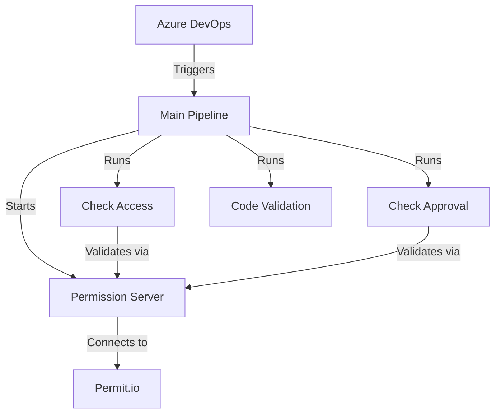

### Pipeline Components

Below is the list of components but we can rearrange these per our requirments. 

| **Component** | **File** | **Purpose** | **Key Features** |
|--------------|----------|-------------|------------------|
| **🚀 Main Pipeline** | [`main-pipeline.yml`](https://dev.azure.com/shivamsfdcwork/PermiForce/_git/PermiForce?version=GBprod&path=/main-pipeline.yml) | Orchestrates the entire process | - PR-based triggers<br>- Environment setup<br>- Sequential checks<br>- Error handling |
| **🔐 Access Check** | [`check-access.yml`](https://dev.azure.com/shivamsfdcwork/PermiForce/_git/PermiForce?version=GBprod&path=/check-access.yml) | Validates PR creation permissions | - Branch mapping<br>- Permission validation<br>- User role verification<br>- Real-time checks |
| **✅ Approval Check** | [`check-approval.yml`](https://dev.azure.com/shivamsfdcwork/PermiForce/_git/PermiForce?version=GBprod&path=/check-approval.yml) | Validates PR approver permissions | - Reviewer validation<br>- Role checking<br>- Approval requirements<br>- Audit logging |
| **📊 Code Validation** | [`check-code.yml`](https://dev.azure.com/shivamsfdcwork/PermiForce/_git/PermiForce?version=GBprod&path=/check-code.yml) | Validates code quality | - Quality checks just for demo<br>- Standards enforcement<br>- Security scanning<br>- Performance metrics |

### Pipeline Flow

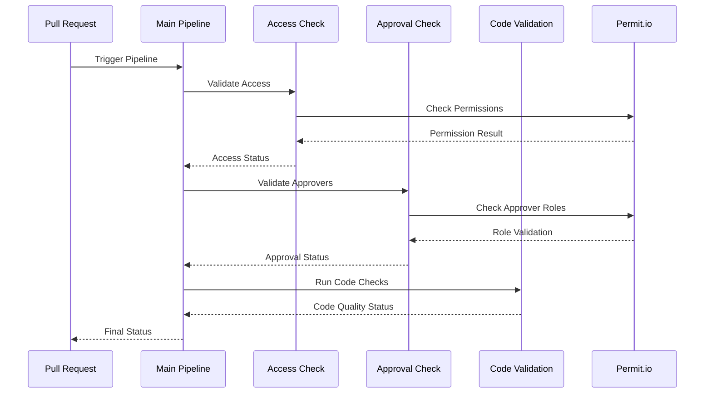

### Environment Configuration

| **Variable** | **Type** | **Description** | **Example** |
|--------------|----------|-----------------|-------------|
| `PERMIT_API_KEY` | Secret | Authentication with Permit.io | `pmt_xxxxxxxxxxxx` |
| `PERMIT_PDP_URL` | URL | PDP endpoint URL | `https://cloudpdp.api.permit.io` |
| `USER_NAME` | String | Current user's email | `user@example.com` |
| `NODE_ENV` | String | Environment mode | `production` |

### Server Endpoints

| **Endpoint** | **Method** | **Request Body** | **Response** | **Purpose** |
|-------------|------------|------------------|--------------|-------------|
| `/check-access` | POST | `{"user": "email", "targetBranch": "branch"}` | `{"allowed": bool, "message": "string"}` | Validates PR creation permissions |
| `/check-pr-approval` | POST | `{"approvers": ["email"], "targetBranch": "branch"}` | `{"allowed": bool, "message": "string"}` | Validates approver permissions |
| `/health` | GET | None | `{"status": "string", "environment": "string"}` | Server health monitoring |

### Error Handling

| **Error Type** | **Code** | **Response Format** | **Resolution** |
|---------------|----------|---------------------|----------------|
| **Permission Denied** | 403 | `{"error": "Permission denied", "details": "string"}` | Check user roles and permissions |
| **Invalid Request** | 400 | `{"error": "Invalid request", "details": "string"}` | Validate request parameters |
| **Server Error** | 500 | `{"error": "Server error", "details": "string"}` | Check server logs and configuration |
| **Network Error** | 503 | `{"error": "Service unavailable", "details": "string"}` | Verify network connectivity |

### Monitoring and Logging

| **Aspect** | **Tools** | **Metrics** | **Alert Threshold** |
|------------|-----------|-------------|---------------------|
| **Permission Checks** | Pipeline Logs | - Success rate<br>- Response time<br>- Error rate | >5% error rate |
| **Server Health** | Health Endpoint | - Uptime<br>- Response time<br>- Error count | >1s response time |
| **Error Tracking** | Error Logs | - Error types<br>- Frequency<br>- Impact | >10 errors/hour |
| **Performance** | Azure DevOps | - Pipeline duration<br>- Resource usage<br>- Queue time | >15min duration |

### Best Practices

| **Category** | **Practice** | **Implementation** | **Benefit** |
|-------------|--------------|-------------------|-------------|
| **Permission Management** | Regular audits | Quarterly role reviews | Maintain security |
| **Pipeline Configuration** | Secure variables | Key vault integration | Protect sensitive data |
| **Monitoring** | Proactive alerts | Custom alert rules | Early issue detection |
| **Documentation** | Keep updated | Automated docs | Clear understanding |

### Troubleshooting Guide

| **Issue** | **Symptoms** | **Diagnosis** | **Solution** |
|-----------|--------------|---------------|--------------|
| **Pipeline Permission Error** | PR creation fails | Check USER_NAME and API key | Verify credentials and permissions |
| **PR Approval Failure** | Approval rejected | Review approver roles | Update role assignments |
| **Server Connection Error** | Timeout errors | Check network and config | Verify endpoint accessibility |
| **Pipeline Timeout** | Job exceeds limit | Review pipeline steps | Optimize pipeline configuration |

---

For more information, contact the project maintainers or visit our documentation.

## Detailed Setup Instructions

### Prerequisites Installation

1. **Node.js Setup**

```bash
# Install Node.js 18.x
curl -fsSL https://deb.nodesource.com/setup_18.x |  sudo  -E  bash  -
sudo apt-get install -y nodejs

# Verify installation
node --version
npm --version
```

2. **Azure DevOps CLI**

```bash
# Install Azure CLI
curl -sL https://aka.ms/InstallAzureCLIDeb |  sudo  bash

# Install Azure DevOps extension
az extension add --name azure-devops
```

### Permit.io SDK Setup

1. **Install Permit.io SDK**

```bash
npm install permitio
```

2. **SDK Configuration**

```javascript
// Example SDK initialization
const  {  Permit  }  =  require('permitio');

const  permit  =  new  Permit({
pdp:  process.env.PERMIT_PDP_URL,  // PDP URL from Permit.io
token:  process.env.PERMIT_API_KEY,  // API Key from Permit.io
debug:  process.env.NODE_ENV  !==  'production'  // Enable debug logs in non-prod
});
```

3. **SDK Usage Examples**

```javascript
// Check permissions
const  allowed  =  await  permit.check(user,  action,  resource);

// Get user permissions
const  permissions  =  await  permit.getPermissions(user);

// Sync roles
await  permit.syncRole(roleName,  permissions);
```

### Azure DevOps Pipeline Setup

1. **Create Pipeline Files**

```bash
# Create pipeline directory
mkdir -p .azure/pipelines

# Create required files
touch .azure/pipelines/main-pipeline.yml
touch .azure/pipelines/check-access.yml
touch .azure/pipelines/check-approval.yml
touch .azure/pipelines/check-code.yml
```

2. **Configure Variable Group**

```bash
# Using Azure CLI
az pipelines variable-group create \
--name permit-variables \
--variables \
PERMIT_API_KEY=""  \
PERMIT_PDP_URL="" \
USER_NAME=""  \
--authorize true
```

### YAML Workflows Architecture

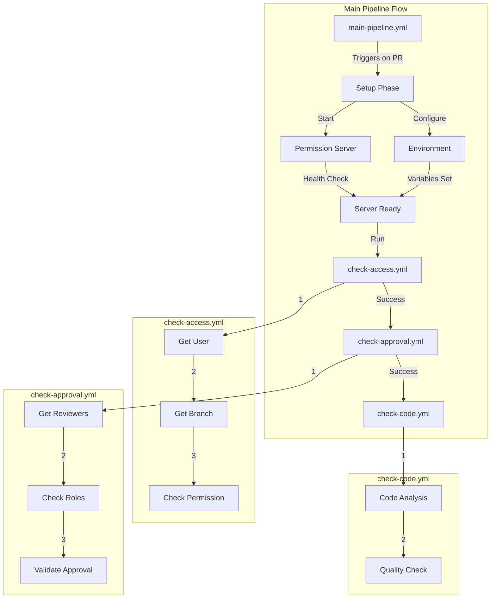

### Pipeline Components Interaction

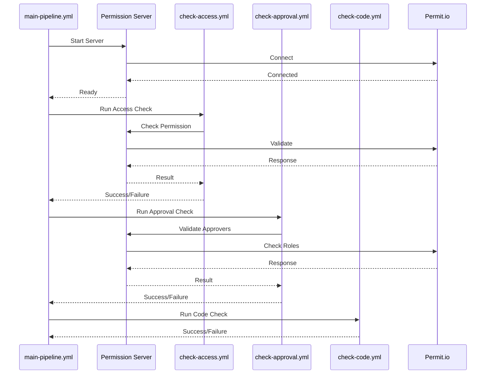

### Environment Configuration

| Variable | Purpose | Example |
|----------|---------|---------|
|  `PERMIT_API_KEY`  | Authentication with Permit.io |  `pmt_xxxxxxxxxxxx`  |
|  `PERMIT_PDP_URL`  | PDP endpoint URL |  `https://cloudpdp.api.permit.io`  |
|  `USER_NAME`  | Current user's email |  `user@example.com`  |
|  `NODE_ENV`  | Environment mode |  `production`  |

### Server Endpoints Detail

| Endpoint | Method | Request Body | Response |
|----------|---------|-------------|-----------|
|  `/check-access`  | POST |  `{"user": "email", "targetBranch": "branch"}`  |  `{"allowed": bool, "message": "string"}`  |
|  `/check-pr-approval`  | POST |  `{"approvers": ["email"], "targetBranch": "branch"}`  |  `{"allowed": bool, "message": "string"}`  |
|  `/health`  | GET | None |  `{"status": "string", "environment": "string"}`  |

## Use Cases

### Core Use Cases

PermiForce provides several key use cases for implementing fine-grained authorization in Azure DevOps CI/CD pipelines:

| **Use Case**               | **Implementation**                                              | **Benefits**                                                                 | **Example Scenario**                                        |
|----------------------------|-----------------------------------------------------------------|-----------------------------------------------------------------------------|------------------------------------------------------------|
| **Environment Access Control** | Control access to different environments (Dev, QA, UAT, Prod)  | - Granular environment access<br>- Secure deployment paths<br>- Environment isolation | Restrict QA environment access to QA team only              |
| **Package Management**         | Control who can publish/consume packages                      | - Secure package distribution<br>- Prevent unauthorized publishes<br>- Track package usage | Only release managers can publish to production feed        |
| **Secret Management**          | Control access to secrets and variables                        | - Secure secret access<br>- Audit secret usage<br>- Prevent unauthorized access | Only pipeline admins can modify production secrets          |
| **Pipeline Triggers**          | Control who can trigger pipelines                             | - Prevent unauthorized runs<br>- Track pipeline triggers<br>- Manage resource usage | Only authorized users can trigger production deployments   |
| **Artifact Management**        | Control artifact access and retention                         | - Secure artifact storage<br>- Manage artifact lifecycle<br>- Track artifact usage | Set different retention policies based on user roles        |
| **Audit and Compliance**       | Track all pipeline activities                                 | - Comprehensive audit trail<br>- Compliance reporting<br>- Activity monitoring | Generate compliance reports for security audits            |

### Advanced Integration Scenarios

The following diagram illustrates how Permit.io integrates with Azure DevOps for various scenarios:

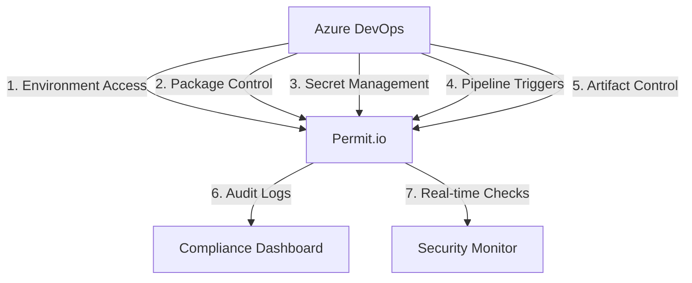

### Implementation Examples

#### 1. Environment Access Control
```yaml
# Example pipeline configuration
steps:
- task: PermitCheck@1
  inputs:
    action: 'ACCESS_ENVIRONMENT'
    environment: 'prod'
    user: '$(Build.RequestedForEmail)'
```

#### 2. Package Management
```yaml
# Package publish control
steps:
- task: PermitCheck@1
  inputs:
    action: 'PUBLISH_PACKAGE'
    feed: 'production'
    package: '$(PackageName)'
```

#### 3. Secret Management
```yaml
# Secret access control
steps:
- task: PermitCheck@1
  inputs:
    action: 'ACCESS_SECRET'
    secret: 'prod-database-connection'
    user: '$(Build.RequestedForEmail)'
```

### Benefits Matrix

| **Feature** | **Traditional Approach** | **Permit.io Approach** | **Advantage** |
|------------|-------------------------|------------------------|---------------|
| **Access Control** | Basic role-based | Fine-grained, dynamic | More precise control |
| **Audit Trail** | Limited logging | Comprehensive tracking | Better visibility |
| **Compliance** | Manual checks | Automated validation | Reduced effort |
| **Security** | Static permissions | Dynamic, context-aware | Enhanced protection |
| **Scalability** | Complex management | Centralized control | Easier maintenance |

### Real-world Scenarios

#### 1. Multi-team Project
- Different teams need different access levels
- Permit.io provides team-specific permissions
- Easy to manage cross-team collaboration

#### 2. Compliance Requirements
- Need to demonstrate access control
- Permit.io provides audit trails
- Easy to generate compliance reports

#### 3. Security-sensitive Projects
- Strict access control requirements
- Permit.io enables fine-grained control
- Real-time permission validation

#### 4. Large-scale Deployments
- Complex permission requirements
- Permit.io scales with the project
- Centralized permission management

## Thank You

Thank you for exploring PermiForce! We hope this solution helps you implement robust role-based access control in your Azure DevOps pipelines. 

For the complete codebase, including all pipeline configurations and implementation details, please visit our Azure DevOps repository:
[PermiForce Repository](https://dev.azure.com/shivamsfdcwork/PermiForce/_git/PermiForce/branches)

Feel free to contribute, provide feedback, or reach out with any questions. Happy coding! 🚀
