# PermiForce: Azure DevOps PR Approval System with Permit.io

  

A robust Pull Request approval system that enforces role-based access control for your Azure DevOps pipelines using Permit.io.

  

## Table of Contents

-  [Overview](#overview)

-  [Core Concepts](#core-concepts)

-  [User Roles and Permissions](#user-roles-and-permissions)

-  [Setup Instructions](#setup-instructions)

-  [Prerequisites](#prerequisites)

-  [Azure DevOps Setup](#azure-devops-setup)

-  [Permit.io Setup](#permitio-setup)

-  [Permission Structure](#permission-structure)

-  [Testing the System](#testing-the-system)

-  [Troubleshooting](#troubleshooting)

-  [Contributing](#contributing)

  

## Overview

  

PermiForce is a sophisticated Pull Request approval system that integrates Azure DevOps with Permit.io's fine-grained permission control. It ensures that only authorized personnel can approve and merge code changes into protected branches, maintaining code quality and security.

  

## Core Concepts

  

The system is built around three main components:

  

1.  **Role-Based Access Control (RBAC)**: Defines who can perform specific actions

2.  **Branch Protection**: Ensures protected branches (qa, uat, prod) have proper approvals

3.  **Automated Validation**: Checks permissions and approvals automatically in the CI/CD pipeline

  

## User Roles and Permissions

  

### Role-Based Access Structure

  

1.  **Developer Role**

- Primary permission: `CREATE_QA_PR`

- Can create Pull Requests to QA branch only

- Cannot approve any PRs

- Users: alice@permiforce.com, bob@permiforce.com

  

2.  **Team Lead Role**

- Permissions:

-  `CREATE_UAT_PR`: Can create PRs to UAT

-  `APPROVE_QA_PR`: Can approve PRs to QA

-  `APPROVE_UAT_PR`: Can approve PRs to UAT

- Cannot create or approve Production PRs

- User: carol@permiforce.com

  

3.  **Release Manager Role**

- Full access with all permissions:

-  `APPROVE_PROD_PR`: Approve Production PRs

-  `APPROVE_QA_PR`: Approve QA PRs

-  `APPROVE_UAT_PR`: Approve UAT PRs

-  `CREATE_PROD_PR`: Create Production PRs

-  `CREATE_QA_PR`: Create QA PRs

-  `CREATE_UAT_PR`: Create UAT PRs

- Highest level of authorization

- User: shivamsfdc.work@gmail.com

  

### Detailed Permission Matrix

  


### Permission Flow Examples
1.  **QA Branch Flow**

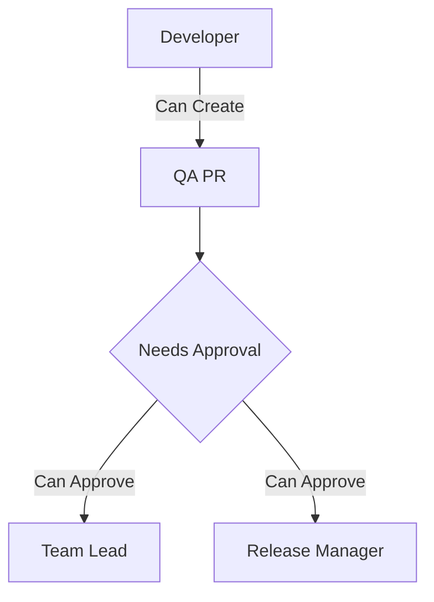

  

2.  **UAT Branch Flow**

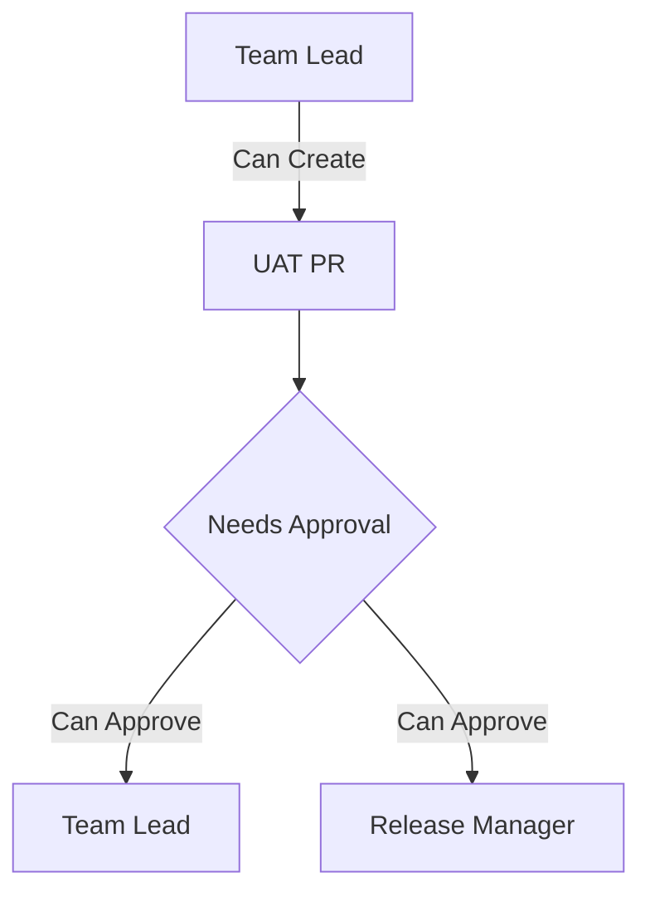

  

3.  **Production Branch Flow**

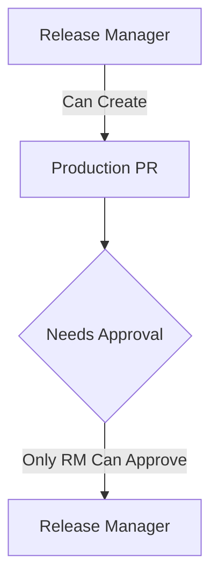

  

### Branch Protection Rules

  


  
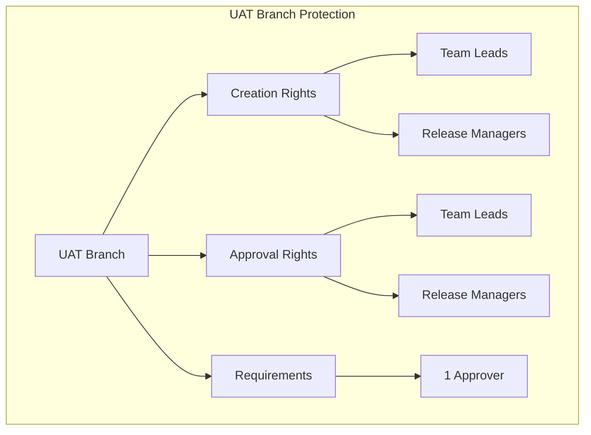
  
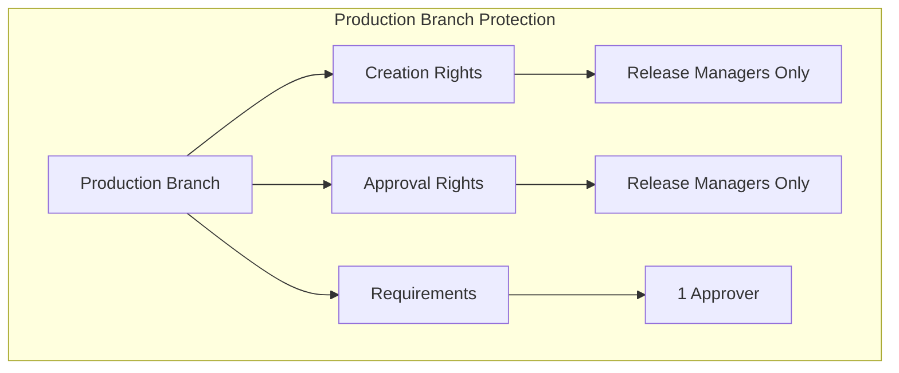

## Setup Instructions
### Prerequisites
- Azure DevOps account with admin access

- Permit.io account

- Node.js 18.x or higher

- Git

### Azure DevOps Setup

1.  **Create a New Pipeline**
	-   Navigate to the Azure DevOps project where you want to create the pipeline.
    
	-   Click on **Pipelines** in the left sidebar, then click on **New Pipeline**.
    
	-   Select the repository you wish to use for your pipeline.
    
	-   Choose **YAML** as the pipeline configuration option.
    
	-   Select **Start from scratch** or choose an existing YAML template if available.
    
	-   In the pipeline editor, use the default YAML configuration and ensure that `main-pipeline.yml` is set as the YAML file to be used for all branches.

2.  **Configure Variable Group**

- Create a variable group named `permit-variables`
- Add the following variables:
```
PERMIT_API_KEY: [Your Permit.io API Key]
PERMIT_PDP_URL: [Your Permit.io PDP URL]
USER_NAME: [User's Email For Simulation]
```

3.  **Branch Protection Rules**
- Go to Project Settings > Repositories
- Set up branch policies for qa, uat, and prod branches
- Enable "Require a minimum number of reviewers"

### Permit.io Setup

1.  **Create a New Project**

- Log in to Permit.io

- Create a new project named "PermiForce" or any you like.

2.  **Define Resources**

- Create a resource named "**DevOps**"

- Add the following permissions/roles:


4.  **Add Users**


  

## Permission Structure

The APPROVE_PROD_PR permission is the highest level of approval permission in the system. It:

- Is exclusively granted to Release Managers

- Required for merging code into the production branch

- Cannot be delegated to lower-level roles

- Requires additional validation checks in the pipeline


## Testing the System

  

1.  **Test as Developer**

```bash
# Set pipeline variable
user_name: alice@permiforce.com
# Expected Results:
- Can create PR to QA ✅
- Cannot create PR to UAT ❌
- Cannot create PR to PROD ❌
```

2.  **Test as Team Lead**

```bash
# Set pipeline variable
user_name: carol@permiforce.com
# Expected Results:
- Can approve QA/UAT PRs ✅
- Cannot approve PROD PRs ❌
```

3.  **Test as Release Manager**

```bash
# Set pipeline variable
user_name: shivamsfdc.work@gmail.com
# Expected Results:
- Can approve all PRs ✅
- Can create PRs to any branch ✅
```

## Troubleshooting

  

Common issues and solutions:

  

1.  **Pipeline Permission Error**

- Check if USER_NAME is correctly set

- Verify Permit.io API key is valid

- Ensure user exists in Permit.io

  

2.  **PR Approval Failure**

- Verify approver has correct role assigned

- Check if branch policies are properly configured

- Ensure pipeline variables are set correctly

  

## Contributing

  

1. Fork the repository

2. Create your feature branch

3. Commit your changes

4. Push to the branch

5. Create a new Pull Request

  

## Technical Details

  

### System Architecture

  

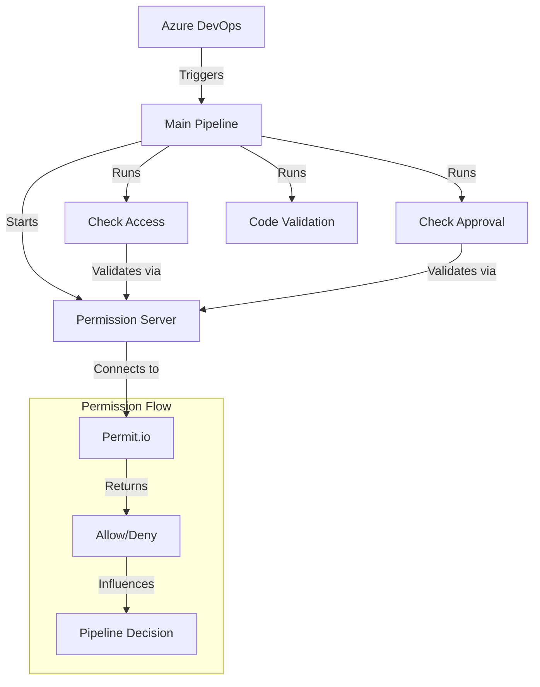

  

### Pipeline Components

  

| Component | File | Purpose | Key Features |

|-----------|------|---------|--------------|

| Main Pipeline |  `main-pipeline.yml`  | Orchestrates the entire process | - Triggers on PR<br>- Sets up environment<br>- Runs checks |

| Access Check |  `check-access.yml`  | Validates PR creation permissions | - Branch mapping<br>- Permission validation |

| Approval Check |  `check-approval.yml`  | Validates PR approver permissions | - Reviewer validation<br>- Role checking |

| Code Validation |  `check-code.yml`  | Validates code quality | - Quality checks<br>- Standards enforcement |

  

### Pipeline Flow

  

1.  **Pipeline Trigger** (`main-pipeline.yml`)

```yaml

trigger:

-  main

pr:

branches:

include:

-  qa

-  uat

-  prod

```

- Activates when PR is created targeting protected branches

- Sets up environment variables and starts permission server

  

2.  **Permission Server Setup**

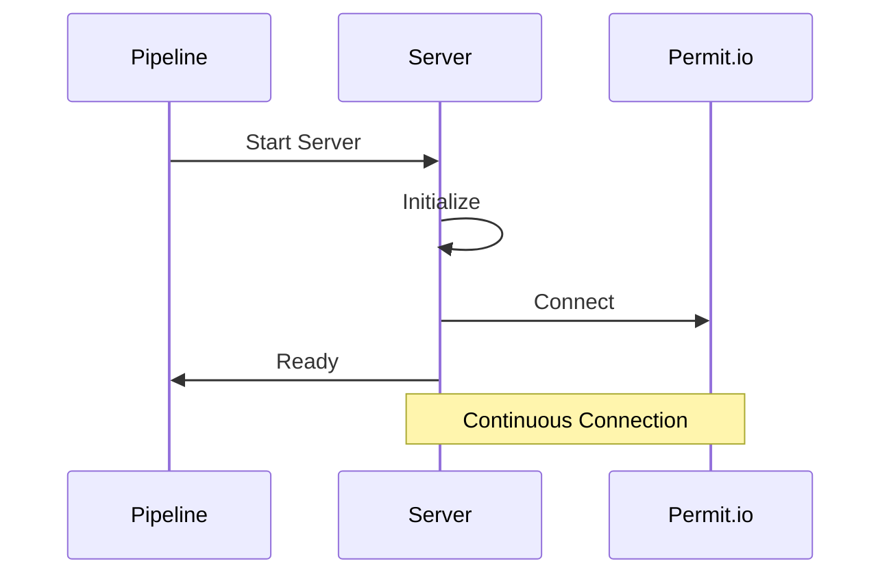

- Initializes Node.js server (`permit-server.js`)

- Establishes connection with Permit.io

- Provides REST endpoints for permission checks

  

3.  **Access Check Flow**

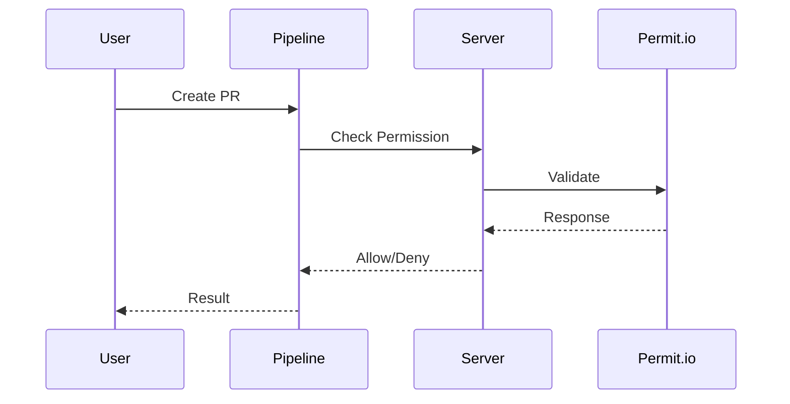

  

### Server Components

  

1.  **Permit Server** (`scripts/permit-server.js`)

```javascript

const  permit  =  new  Permit({

pdp:  process.env.PERMIT_PDP_URL,

token:  process.env.PERMIT_API_KEY,

});

```

  

| Endpoint | Purpose | Response |

|----------|---------|----------|

|  `/check-access`  | Validates PR creation | Allow/Deny with details |

|  `/check-pr-approval`  | Validates approver | Allow/Deny with role check |

|  `/health`  | Server health check | Status with environment info |

  

2.  **Permission Check** (`scripts/permit.js`)

```javascript

async  function  checkAccess(user,  action,  resource)  {

const  allowed  =  await  permit.check(user,  action,  resource);

return  allowed;

}

```

  

### Branch-Specific Workflows

  

1.  **QA Branch Workflow**

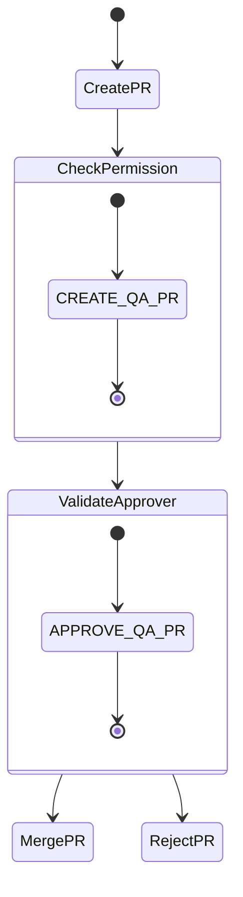

  

2.  **UAT Branch Workflow**

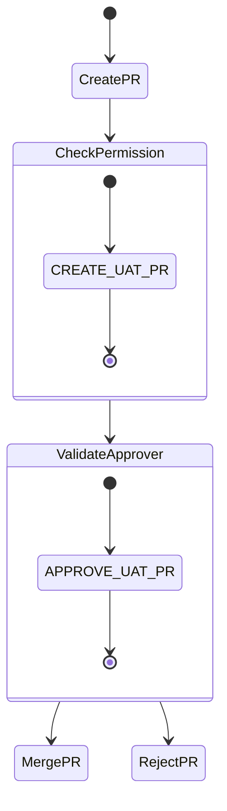

  

3.  **Production Branch Workflow**

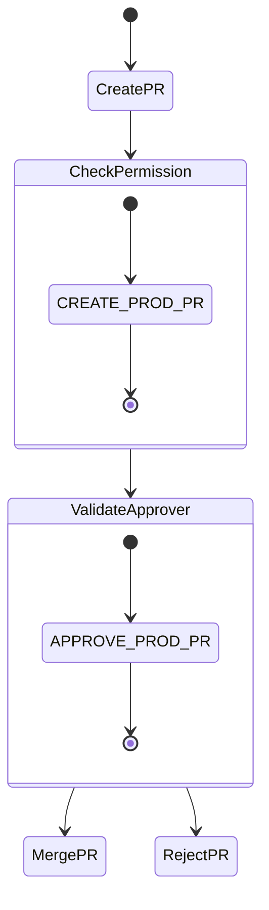

  

### Error Handling and Responses

  

1.  **Permission Errors**

```json

{

"error":  "Permission denied",

"details":  "User lacks APPROVE_PROD_PR permission",

"user":  "developer@permiforce.com",

"requiredPermission":  "APPROVE_PROD_PR"

}

```

  

2.  **Server Errors**

```json

{

"error":  "Server unavailable",

"status":  "error",

"details":  "Failed to connect to Permit.io"

}

```

  

### Monitoring and Logging

  

| Aspect | Tools | Purpose |

|--------|-------|---------|

| Permission Checks | Pipeline Logs | Track all permission validations |

| Server Health | Health Endpoint | Monitor server status |

| Error Tracking | Error Logs | Track system issues |

| Performance | Azure DevOps | Monitor pipeline performance |

  

### Common Troubleshooting Scenarios

  

| Issue | Possible Cause | Solution |

|-------|---------------|----------|

| PR Creation Failed | Invalid permissions | Check user role and permissions |

| Approval Failed | Unauthorized approver | Verify approver's role |

| Server Connection Error | Network/Config issues | Check server logs and config |

| Pipeline Timeout | Server not responding | Check server health endpoint |

  

### Best Practices

  

1.  **Permission Management**

- Regularly audit user roles

- Follow principle of least privilege

- Document permission changes

  

2.  **Pipeline Configuration**

- Keep environment variables secure

- Regular health checks

- Proper error handling

  

3.  **Monitoring**

- Set up alerts for failures

- Monitor permission denials

- Track approval patterns

  

---

  

For more information, contact the project maintainers or visit our documentation.

  

## Detailed Setup Instructions

  

### Prerequisites Installation

  

1.  **Node.js Setup**

```bash

# Install Node.js 18.x

curl -fsSL https://deb.nodesource.com/setup_18.x |  sudo  -E  bash  -

sudo apt-get install -y nodejs

  

# Verify installation

node --version

npm --version

```

  

2.  **Azure DevOps CLI**

```bash

# Install Azure CLI

curl -sL https://aka.ms/InstallAzureCLIDeb |  sudo  bash

# Install Azure DevOps extension

az extension add --name azure-devops

```

  

### Permit.io SDK Setup

  

1.  **Install Permit.io SDK**

```bash

npm install permitio

```

  

2.  **SDK Configuration**

```javascript

// Example SDK initialization

const  {  Permit  }  =  require('permitio');

  

const  permit  =  new  Permit({

pdp:  process.env.PERMIT_PDP_URL,  // PDP URL from Permit.io

token:  process.env.PERMIT_API_KEY,  // API Key from Permit.io

debug:  process.env.NODE_ENV  !==  'production'  // Enable debug logs in non-prod

});

```

  

3.  **SDK Usage Examples**

```javascript

// Check permissions

const  allowed  =  await  permit.check(user,  action,  resource);

  

// Get user permissions

const  permissions  =  await  permit.getPermissions(user);

  

// Sync roles

await  permit.syncRole(roleName,  permissions);

```

  

### Azure DevOps Pipeline Setup

  

1.  **Create Pipeline Files**

```bash

# Create pipeline directory

mkdir -p .azure/pipelines

  

# Create required files

touch .azure/pipelines/main-pipeline.yml

touch .azure/pipelines/check-access.yml

touch .azure/pipelines/check-approval.yml

touch .azure/pipelines/check-code.yml

```

  

2.  **Configure Variable Group**

```bash

# Using Azure CLI

az pipelines variable-group create \

--name permit-variables \

--variables \

PERMIT_API_KEY=""  \

PERMIT_PDP_URL="" \

USER_NAME=""  \

--authorize true

```

  

### YAML Workflows Architecture

  

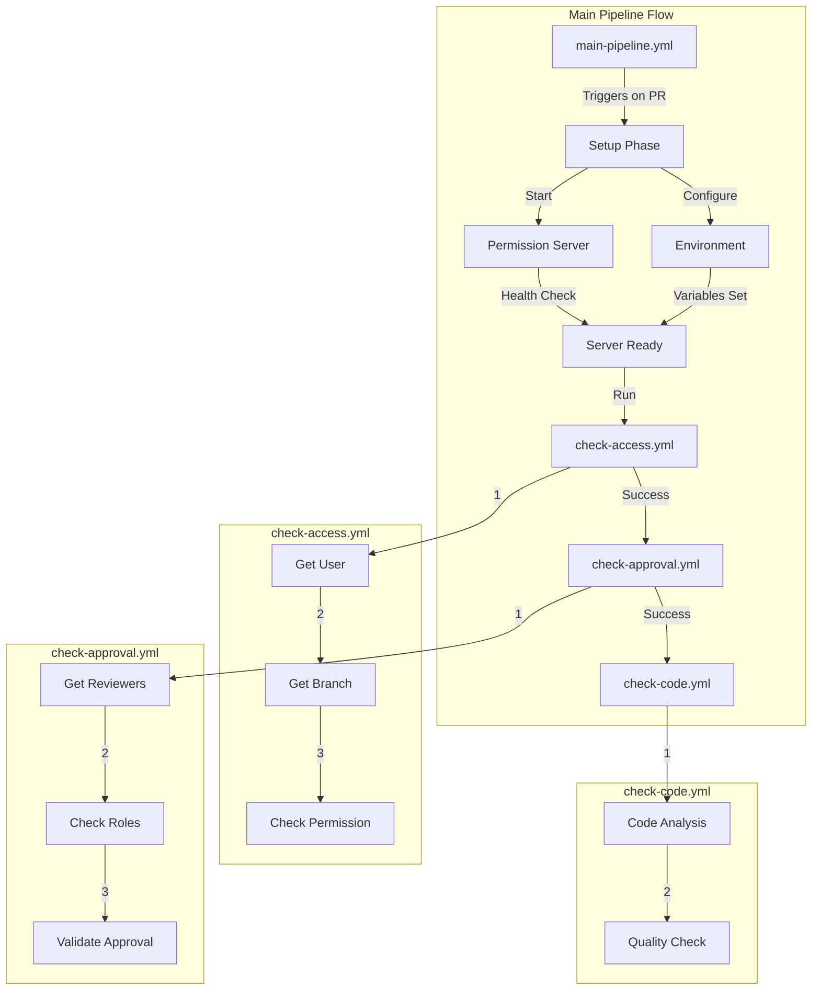

  

### Pipeline Components Interaction

  

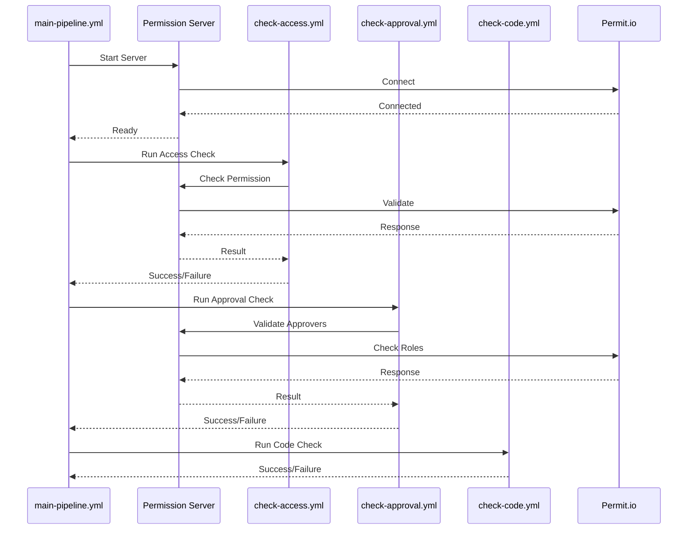

  

### Environment Configuration

  

| Variable | Purpose | Example |

|----------|---------|---------|

|  `PERMIT_API_KEY`  | Authentication with Permit.io |  `pmt_xxxxxxxxxxxx`  |

|  `PERMIT_PDP_URL`  | PDP endpoint URL |  `https://cloudpdp.api.permit.io`  |

|  `USER_NAME`  | Current user's email |  `user@example.com`  |

|  `NODE_ENV`  | Environment mode |  `production`  |

  

### Server Endpoints Detail

  

| Endpoint | Method | Request Body | Response |

|----------|---------|-------------|-----------|

|  `/check-access`  | POST |  `{"user": "email", "targetBranch": "branch"}`  |  `{"allowed": bool, "message": "string"}`  |

|  `/check-pr-approval`  | POST |  `{"approvers": ["email"], "targetBranch": "branch"}`  |  `{"allowed": bool, "message": "string"}`  |

|  `/health`  | GET | None |  `{"status": "string", "environment": "string"}`  |
